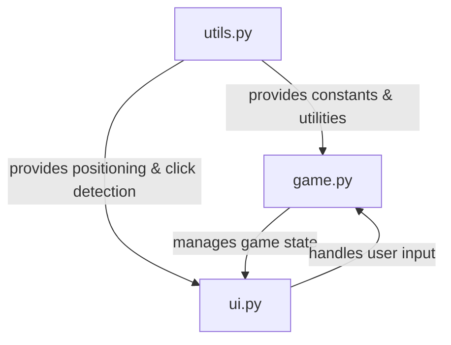

# Memory Game Codebase Map

## File Structure
```
memory_game/
├── utils.py      # Game configuration and utilities
├── game.py       # Game logic and state management
└── ui.py         # User interface and rendering
```

## Component Relationships



## Data Flow

### Game Initialization
1. `game.py` creates `MemoryGame` instance
2. `MemoryGame` creates `UI` instance
3. `reset_game()` calls `utils.generate_cards()`
4. Game state is initialized with cards and flipped status

### Game Loop
1. `ui.py` handles events and returns:
   - Quit signal
   - Card click index
   - Restart signal
2. `game.py` processes events:
   - Updates game state
   - Manages card matching
   - Tracks moves
3. `ui.py` renders:
   - Game board
   - Card states
   - Game over screen

## Key Interactions

### utils.py → game.py
- Provides card generation
- Supplies game constants
- Defines timing parameters

### utils.py → ui.py
- Provides visual constants
- Supplies positioning logic
- Defines click detection

### game.py → ui.py
- Manages game state
- Controls rendering
- Handles user input

### ui.py → game.py
- Reports user actions
- Displays game state
- Manages window events

## State Management

### Game State (game.py)
- Card values
- Flipped status
- Move counter
- Game over flag

### UI State (ui.py)
- Window surface
- Font objects
- Event queue

### Utility State (utils.py)
- Constants
- Configuration
- Helper functions

## Common Operations

### Card Flipping
1. User clicks card
2. UI detects click
3. Game updates state
4. UI renders change

### Card Matching
1. Two cards selected
2. Game checks values
3. State updates
4. UI reflects result

### Game Reset
1. User requests reset
2. Game clears state
3. New cards generated
4. UI updates display 